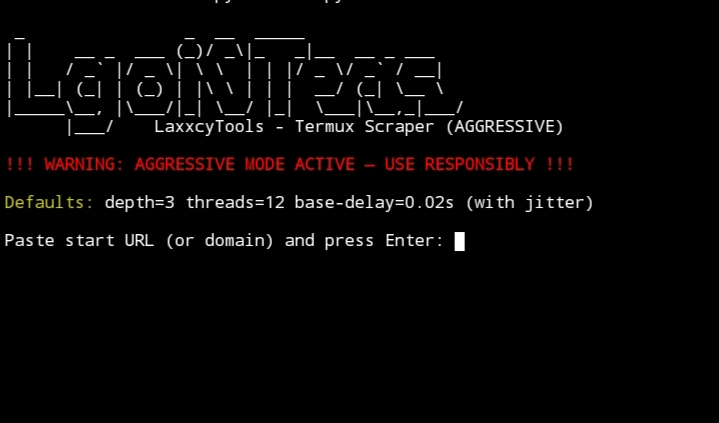

# LaxxcycTools - Web Visual Asset Scraper



Author: Laxxcyc  
Optimized for: Termux (low-end Android)  
Version: 1.0

---

## Deskripsi
LaxxcycTools adalah **single-file Python scraper** untuk Termux yang mengambil **aset visual** sebuah website: HTML, CSS, JavaScript, gambar (termasuk background & favicon), manifest, dan metadata. Tool ini agresif (multi-threaded, depth-following) namun dioptimalkan untuk perangkat low-end dan hanya menggunakan Python standard library (tidak perlu `requirements.txt`).

> Catatan: README ini **tidak** membahas cara serve/host hasil offline. Fokus pada proses scraping dan output.

---

## Fitur Utama
- **Same-domain only** (default) → hanya mengunduh resource dari domain target, tidak ikut domain pihak ketiga/CDN.  
- **Aggressive mode** → multi-thread (default up to 12), depth default lebih tinggi, jitter & delay configurable.  
- **Filter tipe file** (`--types`) → pilih jenis file yang diambil (`html,css,js,images,other`).  
- **Only-images** mode → ambil gambar + CSS (background) saja.  
- **Resume** → skip file yang sudah ada berdasarkan MD5 checksum.  
- **Metadata** → `metadata.json` (per-URL info) dan `url_map.csv`.  
- **Max requests** → batasi jumlah request total.  
- **Ignore robots** → opsional, dengan konfirmasi eksplisit.  
- Semua menggunakan Python stdlib — **tidak perlu `requirements.txt`**.

---

## Dependencies
- **Python 3** (disarankan >= 3.8) di Termux  
- Tidak ada paket pip tambahan

Cek Python:
```bash
python3 --version
```

Install di Termux:
```bash
pkg update && pkg upgrade
pkg install python
```

---

## Instalasi
1. Simpan `scr.py` ke perangkat:
   ```bash
   cd ~
   nano scr.py
   # paste script lalu Ctrl+O Enter Ctrl+X
   chmod +x scr.py
   ```
2. (Opsional) pindahkan ke folder storage:
   ```bash
   mv scr.py /storage/emulated/0/Download/tools/
   cd /storage/emulated/0/Download/tools/
   ```

---

## Cara Pakai
### Interaktif
```bash
python3 scr.py
```

### Non-Interaktif (CLI)
```bash
python3 scr.py https://example.com --out example_scraped --threads 8 --delay 0.05 --depth 2 --types html,css,js,images
```

---

## Contoh Output
```
example.com_laxxcy_tools/
├── metadata.json
├── url_map.csv
└── example.com/
    ├── index.html
    ├── css/
    ├── js/
    └── images/
```

---

## Etika & Legal
- Gunakan **hanya pada domain milik sendiri** atau yang mengizinkan scraping.  
- Jangan gunakan untuk serangan, scraping data pribadi, atau melanggar ToS.  
- Penulis tidak bertanggung jawab atas penyalahgunaan.

---

## Lisensi
Free-to-use untuk pembelajaran & riset keamanan.  
Tidak ada garansi.  

---
